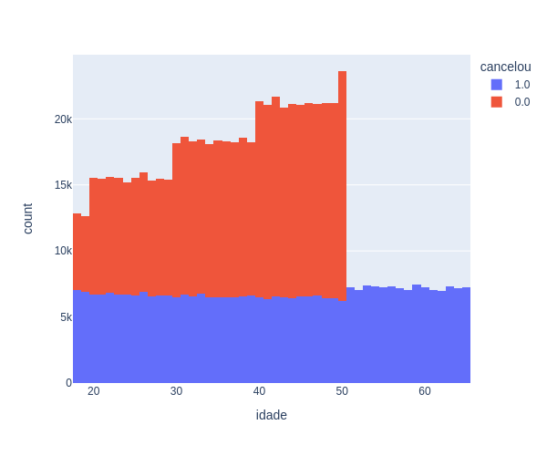
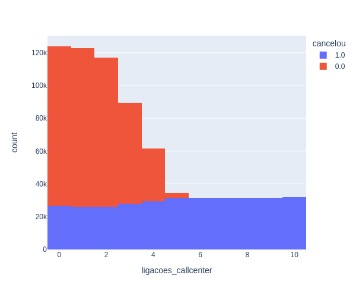
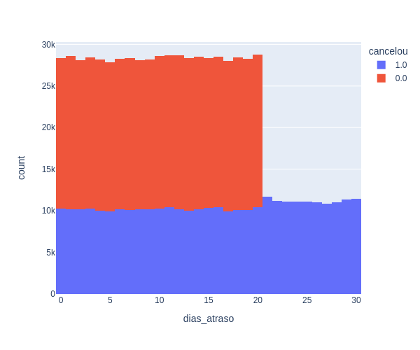

<h1 style="display: flex; align-items: center;">
  Projeto 1 : Python Insights
  
</h1>

## Case - Cancelamento de Clientes

Você foi contratado por uma empresa com mais de 800 mil clientes para um projeto de Dados. Recentemente a empresa percebeu que da sua base total de clientes, a maioria são clientes inativos, ou seja, que já cancelaram o serviço.

Precisando melhorar seus resultados ela quer conseguir entender os principais motivos desses cancelamentos e quais as ações mais eficientes para reduzir esse número.

Base de dados e arquivos: https://drive.google.com/drive/folders/1uDesZePdkhiraJmiyeZ-w5tfc8XsNYFZ?usp=drive_link

## Gráficos do projeto
### Em que situações 100% dos clientes cancelam os serviços?

* Clientes com mais de 50 anos

* Clientes que ligam mais de 5x para o callcenter

* Clientes que estão atrasados mais de 20 dias

