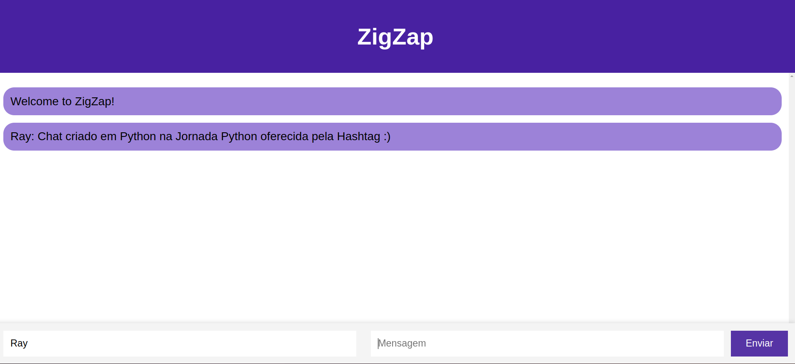

<h1 style="display: flex; align-items: center;">
  Projeto 4 : DEV
  
</h1>

## Case: Chat ao Vivo

Construção de um chat ao vivo inspirado no estilo do WhatsApp.

Arquivos da aula: https://drive.google.com/drive/folders/1kO1a2SnvOJjBUGcApPPZQovANJ4myzr0

## Imagem do chat construído

